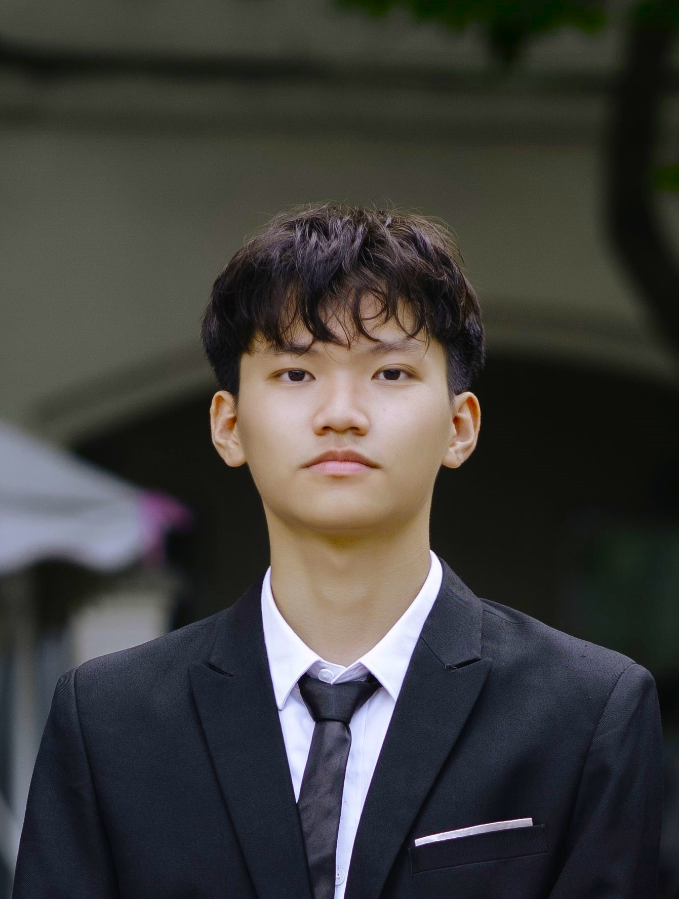
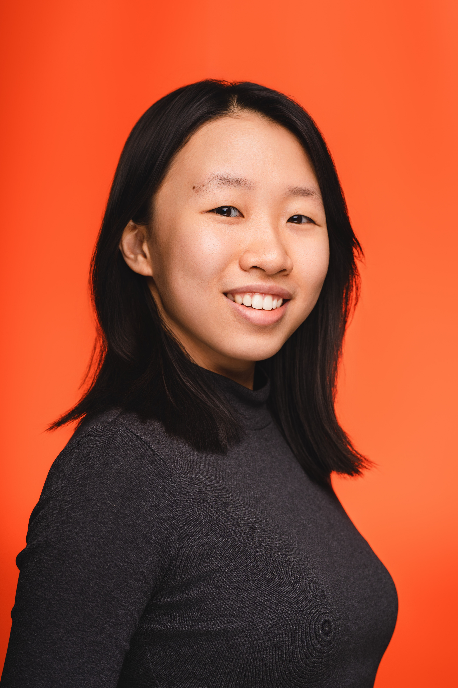
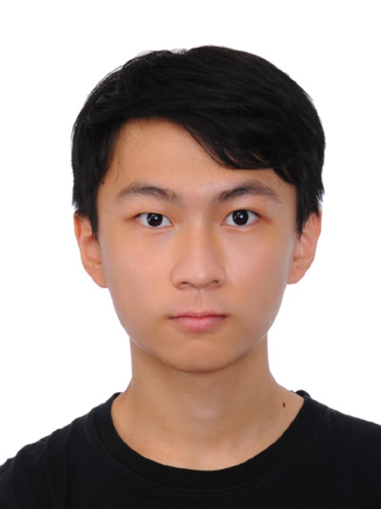

# About Us

We are a team based in the [School of Computing, National University of Singapore](http://www.comp.nus.edu.sg).

You can reach us at the email `seer[at]comp.nus.edu.sg`

## Project team

### John Doe

[[homepage](http://www.comp.nus.edu.sg/~damithch)]
[[github](https://github.com/johndoe)]
[[portfolio](team/johndoe.md)]

- Role: Project Advisor

### DO TRONG UY

[[github](http://github.com/uylulu)]

- Role: Team member

### Chang Shyuan Rhui

[[github](http://github.com/csrhui)]
[[portfolio](team/johndoe.md)]

- Role: Developer
- Responsibilities: Data

### Koh Wai Kei

[[github](http://github.com/yk-tuturu)]
### Wendy Tang

[[github](http://github.com/wenn5055)]
[[portfolio](team/johndoe.md)]

- Role: Developer
- Responsibilities: Dev Ops + Threading

### Ong Jing Jie

[[github](http://github.com/schpeider)]
[[portfolio](team/johndoe.md)]

- Role: Developer
- Responsibilities: UI
