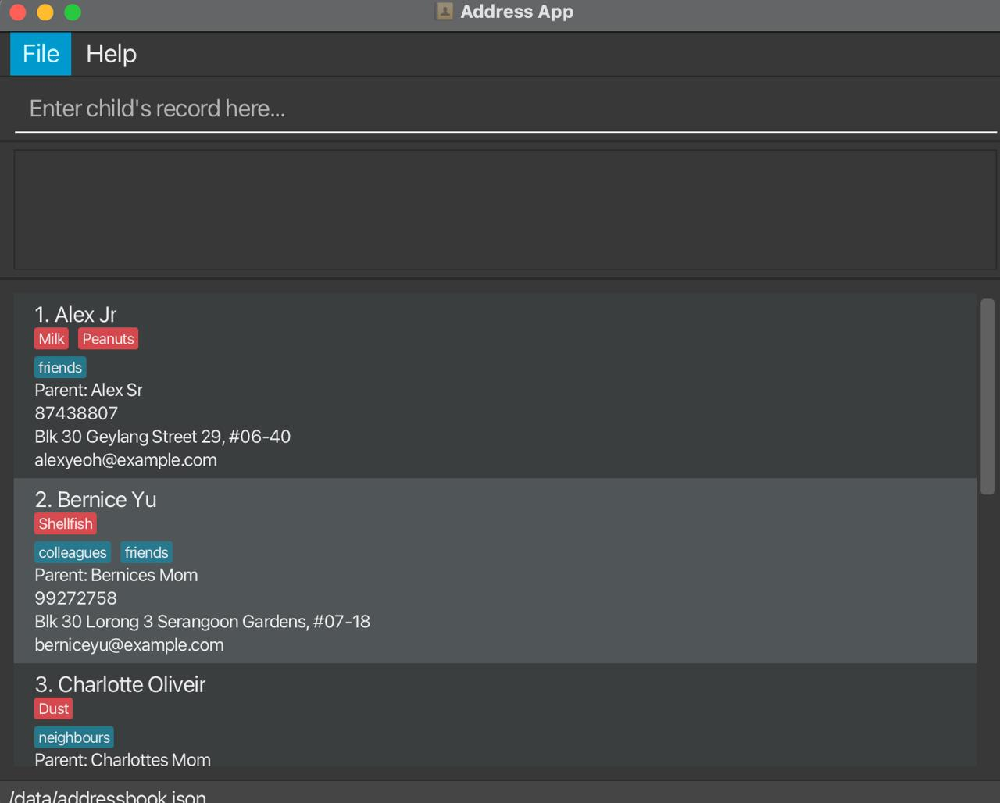
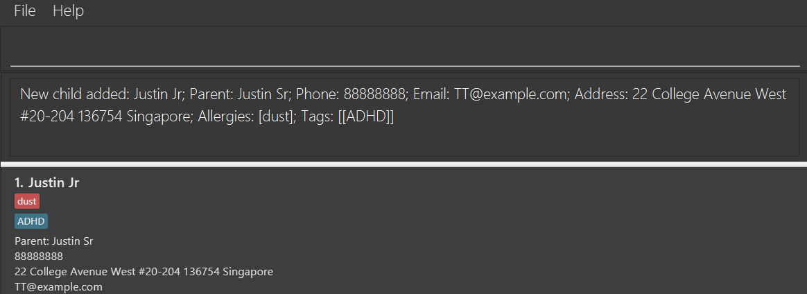
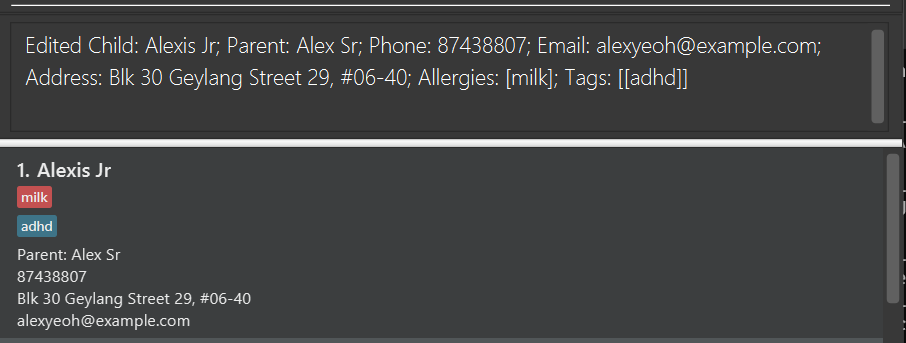
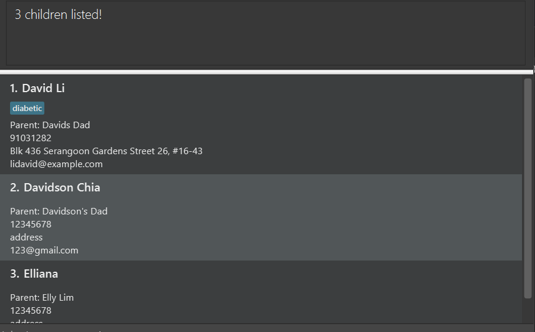
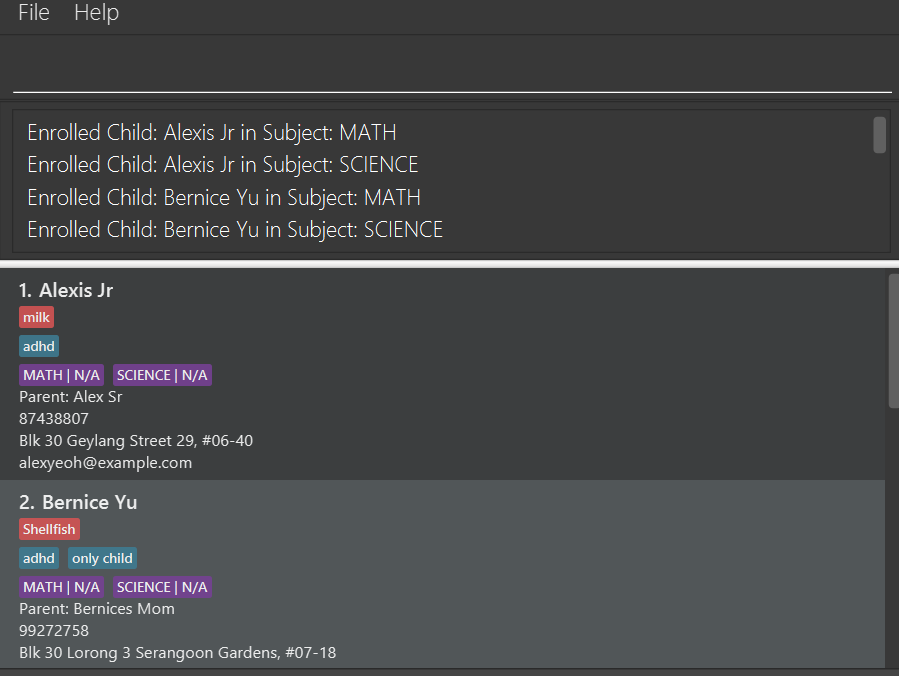
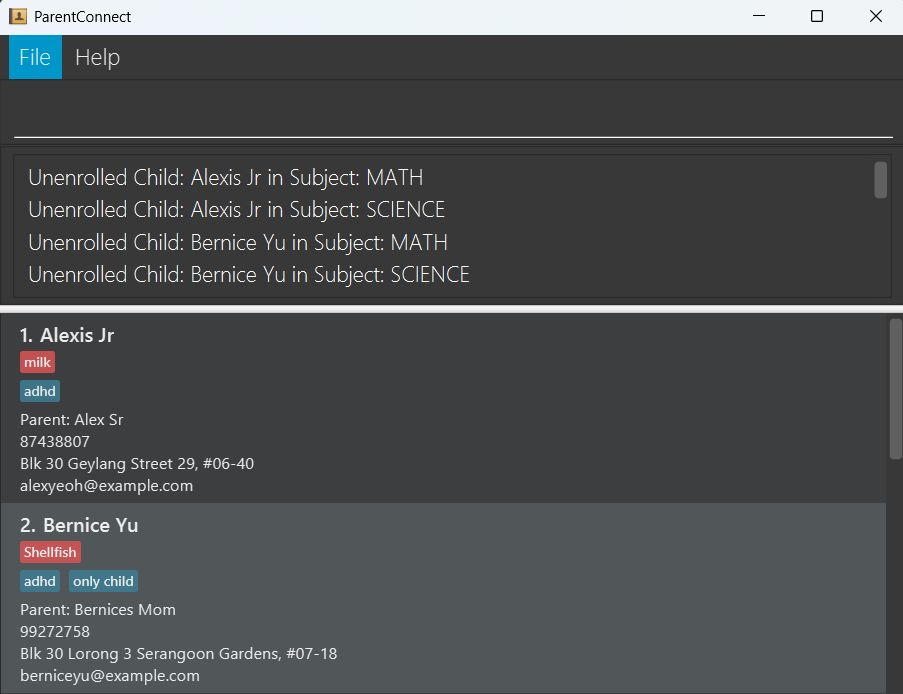
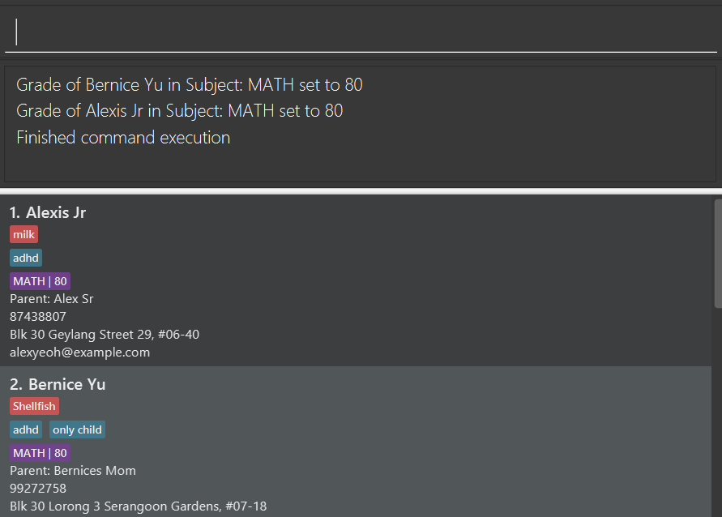

# ParentConnect User Guide

Welcome to **ParentConnect** — your all-in-one digital assistant for **managing children contact information and grade information!**

Tired of dealing with messy spreadsheets or handwritten notes? ParentConnect is a desktop application built especially for kindergarten teachers in Singapore, helping you stay organized, save time, and focus more on your students. With our **clean user interface** and **intuitive commands**, ParentConnect provides a quick and reliable way to search, filter, and update student information.

Designed for fast typists, ParentConnect provides a text field for users to enter commands, while presenting information back in a simple visual interface (GUI) that makes admin work easy and hassle-free. 

<box type="tip" header="Why teachers love ParentConnect 💖">

🕒 **Saves time:** Perform common tasks like adding or finding contacts in just a few keystrokes.  
👩‍🏫 **Built for educators:** Manage all your class contact details — children, parents, allergies and tags, and more — in one place.  
💾 **Worry-free:** Your data is automatically saved and ready to use every time you open the app.  
🧠 **Smart search:** Quickly find children by name, parent, allergy, or tag.

</box>

If you can type quickly, you’ll find ParentConnect faster and smoother than traditional apps — and if not, don’t worry! Its friendly interface and helpful guide will get you started in no time.

<box type="info" seamless> 

To help you get the most out of ParentConnect, this guide walks you through **installation, basic commands**, and **useful features** step-by-step. 

</box>

<!-- * Table of Contents -->
<page-nav-print />

--------------------------------------------------------------------------------------------------------------------

## Quick start

1. Ensure you have Java `17` or above installed in your Computer.<br>
  **Mac users:** Follow the setup guide [here](https://se-education.org/guides/tutorials/javaInstallationMac.html) to install the correct JDK version.<br>
  **Windows users:** Follow the setup guide [here](https://se-education.org/guides/tutorials/javaInstallationWindows.html) to install the correct JDK version. <br>
  **Linux users:** Follow the setup guide [here](https://se-education.org/guides/tutorials/javaInstallationLinux.html) to install the correct JDK version. <br>

1. Download the latest `.jar` file from [here](https://github.com/AY2526S1-CS2103T-F08a-4/tp/releases).

1. Copy the file to the folder you want to use as the _home folder_ for your ParentConnect. This can be any folder in your documents, or on your desktop for easy access. The folder should ideally be empty to prevent any issues with loading the sample data upon initial launch.

1. Open a command terminal. You can do this as follows:

<box type="info" header="How to open a terminal 💻">

**Windows:**  
- Press <kbd>Win + R</kbd>, type `cmd`, and press <kbd>Enter</kbd> to open the Command Prompt.  
- Alternatively, search for **Command Prompt** in the Start menu.

**Mac:**
- Press <kbd>Cmd + Space</kbd> to open Spotlight, type `Terminal`, and press <kbd>Enter</kbd>.
- Or go to **Applications → Utilities → Terminal**.

**Linux (Ubuntu/Debian):**
- Press <kbd>Ctrl + Alt + T</kbd> to open the terminal.
- Or search for **Terminal** in your applications menu.
  </box>

4. Navigate to your home folder and run ParentConnect

<box type="tip" header="Step-by-step 💻">

**Step 1: Change directory to your home folder**
- In the terminal, type:
  ```bash
  cd path/to/your/folder
  ```

- Replace **path/to/your/folder** with the folder where you saved the .jar file.
- Examples:
    ```bash
    cd ~/Documents/ParentConnect       # Mac/Linux
    cd C:\Users\YourName\Documents\ParentConnect  # Windows
    ```

**Step 2: Run the application**

- Type the following command and press <kbd>Enter</kbd>:

    ```bash
    java -jar parentconnect.jar
    ```
  
**Step 3: What you will see**

- A GUI window will open within a few seconds.

- The app comes with sample data so you can try commands right away.

- There is an empty command box at the top to enter your first command!

**Example ParentConnect Interface:**
  

</box>
 

5. Type the command in the command box and press Enter to execute it. e.g. typing **`help`** and pressing Enter will open the help window. Refer to the [Features](#features) below for details of each command. <br>

<box type="tip" header="Common Tasks 💡">

Here are some frequent actions you may want to perform:

* **Add a new child record:** [Add a child](#adding-a-child-add)

* **Edit a child’s contact info:** [Edit child](#editing-a-child-edit)

* **Find a parent’s phone number or search by allergy/tag:** [Find a child](#locating-a-child-record-find)

* **Enroll children into subjects:** [Enroll](#enrolling-children-into-a-subject-enroll)

* **Set scores for a subject:** [Set score](#setting-scores-setscore)

* **Delete records:** [Delete](#deleting-a-child-record-delete)

</box>

--------------------------------------------------------------------------------------------------------------------

## Features

<box type="info" seamless>

**Notes about the command format:**

* Words in `UPPER_CASE` are parameters to be supplied by the user.  
  For example, in `add c/CHILD_NAME`, `CHILD_NAME` can be replaced with `add c/John Doe`.

* Items in square brackets `[ ]` are optional.  
  For example, `c/CHILD_NAME [t/TAG]` can be used as `c/John Doe t/friend` or simply `c/John Doe`.

* Items followed by `…` can be used multiple times (including zero times).  
  For example, `[t/TAG]…` can be left empty, or contain `t/friend`, `t/friend t/family`, etc.

* Parameters can be in any order.  
  For example, `c/CHILD_NAME p/PHONE_NUMBER` is equivalent to `p/PHONE_NUMBER c/CHILD_NAME`.

* Commands that don’t take parameters (`help`, `list`, `exit`, `clear`) will ignore extra text.  
  For example, `help 123` is interpreted as `help`.

* When copying commands from a PDF, make sure spaces at line breaks are preserved to avoid errors.
  </box>

### Viewing help : `help`

Shows a message explaining how to access the help page.

Format: `help`


### Adding a child: `add`

Adds a new child record to ParentConnect. At minimum, the child's name, parent name, parent phone number, email and address need to be provided. (Refer to [this section](#data-constraints-advanced) for information regarding the various parameters)

Format: `add c/CHILD_NAME b/PARENT_NAME p/PARENT_PHONE_NUMBER e/PARENT_EMAIL a/ADDRESS [r/ALLERGIES]…​ [t/TAG]…​`

<box type="info" seamless>

**Tip:** Tags and allergies are optional fields! A child can have as many tags or allergies as necessary, or none at all. This information can also be edited later with the [edit](#editing-a-child--edit) command
</box>

<box type="tip" header="Examples: ">

* `add c/Ella Dawson b/Helen Dawson p/91234567 e/hofmann@example.com a/John street, block 123, #01-01`<br>
Adds a child named Ella Dawson who has parent Helen Dawson, phone number 91234567, email: hofmann@example.com, and address John street, block 123, #01-01

* `add c/Justin Jr b/Justin Sr p/88888888 e/TT@example.com a/22 College Avenue West #20-204 136754 Singapore t/ADHD r/dust`<br>
Adds a child named Justin Jr, with parent Justin Sr, phone number, email and address as shown above, and the optional tag ADHD with an allergy to dust.

**Result:**


</box>

<box type="warning" header="Duplicate children detection">

* Children are detected to be duplicates only if both the **child name** and **parent name** are the same. This is to allow for multiple children to share a phone number/email, as siblings will usually share their parent's contact details.
* It is possible for both child and parent to share a name legitimately, but such cases are unlikely

</box>

### Listing all children : `list`

Shows a list of all children in ParentConnect.

Format: `list`

### Editing a child : `edit`

Edits an existing child in ParentConnect. This can be used to update contact information, or to take note of special needs and considerations. 

Format: `edit INDEX [c/CHILD_NAME] [b/PARENT_NAME] [p/PARENT_PHONE_NUMBER] [e/PARENT_EMAIL] [a/ADDRESS] [r/ALLERGIES]…​ [t/TAG]…​`

<box type="info" seamless> 

* Edits the child at the specified `INDEX`. The index refers to the index number shown in the displayed child list. The index **must be a positive integer** 1, 2, 3, …​
* At least one of the optional fields must be provided.
* Existing values will be updated to the input values.
* When editing tags or allergies, the existing tags/allergies of the child will be removed i.e adding of tags/allergies is **not cumulative**.
* You can remove all the child’s tags or allergies by typing `t/` or `r/` without
    specifying any tags after it.

</box>


<box type="tip" header="Examples:">

*  `edit 1 p/91234567 e/johndoe@example.com` <br>
Edits the phone number and email address of the 1st child's parent to be `91234567` and `johndoe@example.com` respectively.

*  `edit 2 c/Alison Wang t/` <br>
   Edits the name of the 2nd child to be `Alison Wang` and clears all tags<br>

*  `edit 2 c/Alexis Jr t/adhd r/milk` <br>
Edits the name of the 2nd child to be `Alexis Jr` and adds the tags adhd and allergy to milk<br>



</box>

### Locating a child record: `find`

Finds a child record with **partial string matching**. You can search for a specific child entry using their name or their parent's name. Or you can filter to find all children with a specific tag, or a specific allergy to accomodate their needs.

Format: `find [c/CHILD_NAME] [b/PARENT_NAME] [r/ALLERGIES]…​ [t/TAG]…​`

<box type="info" seamless>

* The search is case-insensitive. e.g `hans` will match `Hans`
* The order of the keywords does not matter. e.g. `Hans Bo` will match `Bo Hans`
* Only the corresponding field is searched. e.g. `b/hans` will only match with parents named `Hans` and not children
* Even partial words will be matched e.g. `Han` will match `Hans`, `child` will match `only child`
* Children records matching at least one keyword will be returned (i.e. `OR` search).
  e.g. `c/Hans r/ADHD` will return records of all children named `Hans` and of all children with `ADHD`
* At least one of the optional fields must be provided
* Each category supports multi-search e.g. `c/John Marcus Hans` will return records of all children named either `John`, `Marcus` or `Hans`

</box>

<box type="tip" header="Examples:">

* `find c/John` returns records of all children with `john` in their name
* `find c/Marcus Vertin b/Hoffman r/Dust` returns records where the child is named either `Marcus` or `Vertin`, where the parent is named `Hoffman`, and where the child is allergic to `dust` (as long as any of the 4 conditions are fulfilled)
* `find c/David Li` will match with `Davidson`, `David Becker`, `Elliana` and any other name with substrings `David` or `Li` in them.

**Result:** 


</box>

### Deleting a child record : `delete`

<box type="warning">

Deletes in ParentConnect are irreversible! See [this section](#editing-the-data-file) for information on backups. 

</box>

Deletes the specified child record(s) from ParentConnect. This can be used when children graduate or otherwise leave. 

Format: `delete INDEXES…​`

<box type="info" seamless>

* Deletes the child record at the specified `INDEXES`.
* The index refers to the index number shown in the displayed children list.
* Multiple indexes can be specified. The indexes must be separated with a space (eg. `delete 1 2 3`)
* The index **must be a positive integer** 1 2 3, …​

</box>

<box type="tip" header="Examples:">

* `list` followed by `delete 2` deletes the 2nd child record in ParentConnect.
* `find Betsy` followed by `delete 1` deletes the 1st child record in the results of the `find` command.
* `list` followed by `delete 1 2 3 4` deletes entries 1 - 4 in ParentConnect.

</box>

### Enrolling children into a subject : `enroll`

Enrolls children into subjects in ParentConnect. Currently, we support 3 fixed subjects of `Math`, `English`, and `Science`<br>

When children are first enrolled into a subject, their scores will always be displayed as `N/A`. The [setscore](#setting-scores--setscore) command can then be used to change their scores.

Format:
`enroll INDEXES…​ s/SUBJECT`

<box type="info" seamless>

* Enrolls all children at the specified `INDEXES` into the listed subjects.
* You can also enroll **all children** currently listed by using the `all` keyword instead of indexes. 
* When the `all` keyword is used, it only includes children in the current list view. If you have executed the `find` command beforehand, the command only applies to the result returned by `find`
* `INDEXES` must be **positive integers** 1, 2, 3, …
* `SUBJECT` refers to the subject name(s) and can be repeated to enroll a child in multiple subjects.

</box>

<box type="tip" header="Examples:">

* `enroll 1 s/english`  
  Enrolls the child at index 1 into the English subject.

* `enroll 1 2 3 s/math`  
  Enrolls children at indexes 1, 2, and 3 into the Math subject.

* `enroll all s/math s/science`  
  Enrolls all listed children into both Math and Science subjects.

**Sample output:**


</box>

### Unenrolling children from a subject : `unenroll`
<box type="warning">
All information pertaining to the student's scores will also be deleted on unenrollment!
</box>

Unenrolls children from subjects in ParentConnect. The usage is largely similar to `enroll`.

Format:
`unenroll INDEXES... s/SUBJECT`

<box type="info" seamless>

* Unenrolls all children at the specified `INDEXES` from the listed subjects.
* You can also unenroll **all children** currently listed by using the `all` keyword instead of indexes.
* When the `all` keyword is used, it only includes children in the current list view. If you have executed the `find` command beforehand, the command only applies to the result returned by `find`
* `INDEXES` must be positive integers 1, 2, 3, …
* `SUBJECT` refers to the subject name(s) and can be repeated to unenroll a child from multiple subjects.

</box>

<box type="tip" header="Examples:">

* `unenroll 1 s/english`  
  Unenrolls the child at index 1 from the English subject.

* `unenroll 1 2 3 s/math`  
  Unenrolls children at indexes 1, 2, and 3 from the Math subject.

* `unenroll all s/math s/science`  
  Unenrolls all listed children from both Math and Science subjects.

* Executing `find c/Danny` followed by `unenroll all s/math` will only unenroll all found children named `Danny` into the subject

**Sample output:**


</box>


### Setting scores : `setscore`

Sets the score of children for a specific subject in ParentConnect.

**Format:**  
`setscore INDEXES... s/SUBJECT g/SCORE`

<box type="info" seamless>

* Sets the score for the specified children at `INDEXES` for the given `SUBJECT`.
* You can also set scores for **all children** currently listed by using the `all` keyword instead of indexes.
* When the `all` keyword is used, it only includes children in the current list view. If you have executed the `find` command beforehand, the command only applies to the result returned by `find`
* Only **one subject** and **one score** can be specified per command.
* `INDEXES` must be positive integers 1, 2, 3, …
* `SCORE` must be an integer between 0 - 100

</box>

<box type="tip" header="Examples:">

* `setscore 2 s/science g/100`  
  Sets the Science score of the child at index 2 to 100.

* `setscore 1 2 3 s/math g/90`  
  Sets the Math score of children at indexes 1, 2, and 3 to 90.

* `setscore all s/math g/85`  
  Sets the Math score of all listed children to 85.

**Sample output:**


</box>

### Clearing all entries : `clear`

<box type="warning">

This command is irreversible! Make sure to [take a backup](#editing-the-data-file) if you are worried about accidental data loss. 

</box>

Clears all entries from ParentConnect.

Format: `clear`

### Exiting the program : `exit`

Exits the program.

Format: `exit`

### Saving the data

ParentConnect data are saved in the hard disk automatically after any command that changes the data. There is no need to save manually.

### Editing the data file

ParentConnect data are saved automatically as a JSON file `[JAR file location]/data/parentconnect.json`. Backup save files can be created just by making copies of this save file at regular intervals. Advanced users are welcome to update data directly by editing that data file.

<box type="important">

**Caution:**
If your changes to the data file makes its format invalid, ParentConnect will discard all data and start with an empty data file at the next run.  Hence, it is recommended to take a backup of the file before editing it.<br>
Furthermore, certain edits can cause the ParentConnect to behave in unexpected ways (e.g., if a value entered is outside the acceptable range). Therefore, edit the data file only if you are confident that you can update it correctly.

</box>


--------------------------------------------------------------------------------------------------------------------

## Data constraints (advanced)

Below is a summary for the constraints for the different parameters that can be supplied to commands, such as names, phone numbers, emails and subjects

Data Type         | Constraints
------------------|----------------------------------------------------------------------------------------------------------------------------------------------------------------------
**Names**    | <ul><li>Names should only consist of **alphabets** and **spaces**, and must contain at least 1 letter.</li><li>The following special characters are also allowed: `()-'/,.`.</li><li>For `/`, as it is used as a command delimiter, a new word in the name cannot start with anything that looks like a command prefix. Example: `child b/o` is not a valid name, as `b/o` collides with the `b/` prefix. However, `childb/o` is allowed, as it is not a new word. `child d/o` is also allowed, as `d/` is not a prefix.</li><li>Any other special characters, numbers, or characters in other languages, are disallowed.</li><li>Names are also **case-insensitive**, meaning `john` and `John` are considered the same person.</li><li>Spaces are automatically normalized, meaning  <code style="white-space: pre;">john     doe</code>  will be converted to `john doe`</li></ul>     
**Phone number**  | Should strictly be **8 digits** Singaporean phone number
**Email** | Follows the format `local-part@domain`<br>**Local-part**: Should only contain alphanumeric characters and these special characters: `+_.-`. May not start or end with any special characters<br>**Separator:** `@` symbol<br>**Domain Name:** Made up of domain labels separated by periods<br>**Domain Requirements:** Must end with a domain label at least 2 characters long. Each domain label must start and end with alphanumeric characters. Each domain label must consist of alphanumeric characters, separated only by hyphens, if any
**Address**   | No restrictions, as long as not empty. Some errors may also occur if slashes are used in a way that resembles a prefix used by ParentConnect, eg `26 C/address Road`, however slashes are generally rare in legitimate addresses so this should not be a concern. 
**Tag/Allergy**   | Tag/Allergy information should only contain **alphanumeric characters and spaces**, and it should not be blank. Max length of 50 characters.
**Indexes** | Must be between 1 and the length of the currently displayed list
**Subject** | Must be one of `math`, `science`, `english`. Note that subjects are **case-insensitive**
**Scores** | Must be a whole number between 0 - 100

--------------------------------------------------------------------------------------------------------------------

## FAQ

**Q**: Why does the system say "duplicate person" when adding a child with a different phone number/address/email?<br>
**A**: Students are identified uniquely by the parent and child name combination, not by contact details. This is because siblings may share the same contact details as they are from the same family. While it may be possible for two children and parent pairs to share the same name, we don't foresee this key collision having a high likelihood of occurring in the scope of one kindergarten.

**Q**: Why is each child attached to only one parent? Can I put both parents?<br>
**A**: In most schools and kindergartens, one of the parents is usually required to be listed as the 'primary guardian', and our system reflects that. It is far more important to store the contact details of the primary guardian as they would be the first point of contact in case of any emergencies. In future updates we may add on the feature to have multiple parent contacts.

**Q**: Why does ParentConnect only support 8 digit phone numbers? What about international numbers?<br>
**A**: ParentConnect is targeted at kindergartens in Singapore and currently only supports 8-digit Singapore phone numbers. This ensures data consistency and simplifies local operations.

**Q**: Does ParentConnect support enrollment for subjects other than those listed?<br>
**A**: This is a known issue, and it is one of the features coming soon in release `2.0`

**Q**: Why can't I add a score with decimal points?<br>
**A**: Scores are stored as integers. It is usually rare for kindergartens to require such finetuned score tracking that they need decimal points. However, this feature may potentially be added in `2.0`

**Q**: I made a mistake by bulk deleting some children. Can I undo? <br>
**A**: No, unfortunately ParentConnect does not have an undo feature. However, if you have a backup of your data file,
you can restore the deleted data by replacing the current data file with your backup.

**Q**: Where can I find the data file?<br>
**A**: The data file is located in the `data` folder inside your ParentConnect home folder (i.e., the folder where the 
jar file is located).

**Q**: How do I transfer my data to another Computer?<br>
**A**: Install the app in the other computer and overwrite the empty data file it creates with the file that contains
the data of your previous ParentConnect home folder.

**Q**: Can I use ParentConnect on my mobile device?<br>
**A**: No, ParentConnect is a desktop application and does not support mobile devices.

**Q**: Can I use ParentConnect without the GUI?<br>
**A**: No, while ParentConnect is optimized fast typists, it still requires the GUI to operate since we want to make 
information visualisation easier.

**Q**: How do I report bugs or suggest new features?<br>
**A**: Please visit our [GitHub Issues page](https://github.com/AY2526S1-CS2103T-F08a-4/tp/issues) and make a new issue.
We welcome all kinds of feedback!


--------------------------------------------------------------------------------------------------------------------

## Known issues

1. **When using multiple screens**, if you move the application to a secondary screen, and later switch to using only the primary screen, the GUI will open off-screen. The remedy is to delete the `preferences.json` file created by the application before running the application again.
2. **If you minimize the Help Window** and then run the `help` command (or use the `Help` menu, or the keyboard shortcut `F1`) again, the original Help Window will remain minimized, and no new Help Window will appear. The remedy is to manually restore the minimized Help Window.

--------------------------------------------------------------------------------------------------------------------

## Command summary

Action     | Format, Examples
-----------|----------------------------------------------------------------------------------------------------------------------------------------------------------------------
**Add**    | `add c/CHILD_NAME b/PARENT_NAME p/PARENT_PHONE_NUMBER e/PARENT_EMAIL a/ADDRESS [r/ALLERGIES]…​ [t/TAG]…​` <br> e.g., `add c/Ho Ho b/James Ho p/22224444 e/jamesho@example.com a/123, Clementi Rd, 1234665 r/sunlight r/grass t/friend t/colleague`
**Clear**  | `clear`
**Delete** | `delete INDEXES`<br> e.g., `delete 1 2 3`
**Edit**   | `edit INDEX [c/CHILD_NAME] [b/PARENT_NAME] [p/PARENT_PHONE_NUMBER] [e/PARENT_EMAIL] [a/ADDRESS] [r/ALLERGIES]…​ [t/TAG]…​`<br> e.g.,`edit 2 b/James Lee e/jameslee@example.com`
**Find**   | `find [c/CHILD_NAME] [b/PARENT_NAME] [r/ALLERGIES] [t/TAG]`<br> e.g., `find c/John Jake Marcus b/Paul Mary r/Dust Peanut t/ADHD Diabetic`
**List**   | `list`
**Help**   | `help`
**Enroll** | `enroll INDEXES s/SUBJECT`
**Unenroll**| `unenroll INDEXES s/SUBJECT`
**SetScore**| `setscore INDEXES s/SUBJECT g/SCORE`

--------------------------------------------------------------------------------------------------------------------
