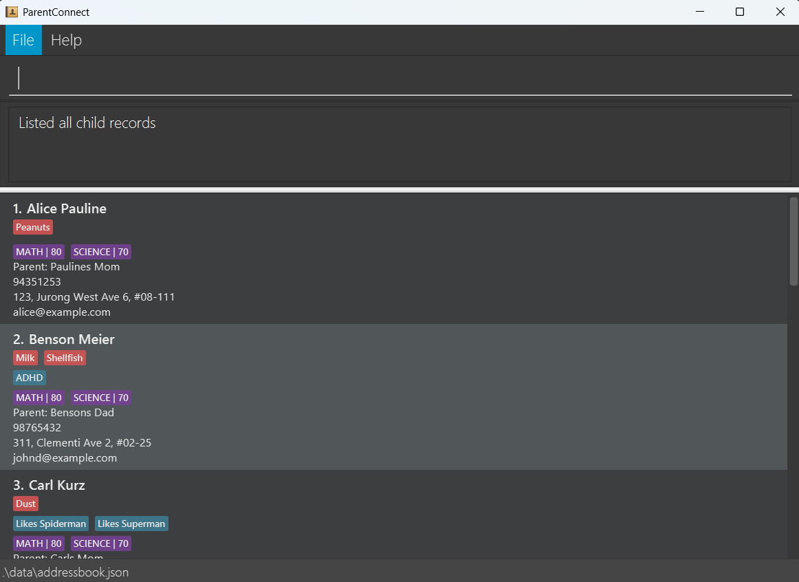

# ParentConnect User Guide

ParentConnect is a **desktop app for kindergarten teachers to manage parents' contacts, optimized for use via a  Line Interface** (CLI) while still having the benefits of a Graphical User Interface (GUI). If you can type fast, ParentConnect can get your contact management tasks done faster than traditional GUI apps.

<!-- * Table of Contents -->
<page-nav-print />

--------------------------------------------------------------------------------------------------------------------

## Quick start

1. Ensure you have Java `17` or above installed in your Computer. 
   **Mac users:** Ensure you have the precise JDK version prescribed [here](https://se-education.org/guides/tutorials/javaInstallationMac.html).

1. Download the latest `.jar` file from [here](https://github.com/se-edu/addressbook-level3/releases).

1. Copy the file to the folder you want to use as the _home folder_ for your ParentConnect.

1. Open a command terminal, `cd` into the folder you put the jar file in, and use the `java -jar addressbook.jar` command to run the application. 
   A GUI similar to the below should appear in a few seconds. Note how the app contains some sample data. 
   

1. Type the command in the command box and press Enter to execute it. e.g. typing **`help`** and pressing Enter will open the help window. 
   Some example commands you can try:

   * `list` : Lists all children.

   * `add c/Jane Doe b/John Doe p/98765432 e/johnd@example.com a/John street, block 123, #01-01` : Adds a child named `Jane Doe` to ParentConnect.

   * `delete 3` : Deletes the 3rd child record shown in the current list.

   * `clear` : Deletes all child record.

   * `exit` : Exits the app.

1. Refer to the [Features](#features) below for details of each command.

--------------------------------------------------------------------------------------------------------------------

## Features

<box type="info" seamless>

**Notes about the command format:** 

* Words in `UPPER_CASE` are the parameters to be supplied by the user. 
  e.g. in `add n/NAME`, `NAME` is a parameter which can be used as `add n/John Doe`.

* Items in square brackets are optional. 
  e.g `n/NAME [t/TAG]` can be used as `n/John Doe t/friend` or as `n/John Doe`.

* Items with `…`​ after them can be used multiple times including zero times. 
  e.g. `[t/TAG]…​` can be used as ` ` (i.e. 0 times), `t/friend`, `t/friend t/family` etc.

* Parameters can be in any order. 
  e.g. if the command specifies `n/NAME p/PHONE_NUMBER`, `p/PHONE_NUMBER n/NAME` is also acceptable.

* Extraneous parameters for commands that do not take in parameters (such as `help`, `list`, `exit` and `clear`) will be ignored. 
  e.g. if the command specifies `help 123`, it will be interpreted as `help`.

* If you are using a PDF version of this document, be careful when copying and pasting commands that span multiple lines as space characters surrounding line-breaks may be omitted when copied over to the application.
</box>

### Viewing help : `help`

Shows a message explaining how to access the help page.

Format: `help`

### Adding a child: `add`

Adds a new child record to ParentConnect.

Format: `add c/CHILD_NAME b/PARENT_NAME p/PARENT_PHONE_NUMBER e/PARENT_EMAIL a/ADDRESS [r/ALLERGIES]…​ [t/TAG]…​`

<box type="tip" seamless>

**Tip:** Tags and allergies are optional fields! A child can have as many tags or allergies as necessary, or none at all.
</box>

Examples:
* `add c/Ella Dawson b/Helen Dawson p/91234567 e/hofmann@example.com a/John street, block 123, #01-01`
* `add c/Justin Jr b/Justin Sr p/88888888 e/TT@example.com a/22 College Avenue West #20-204 136754 Singapore t/ADHD r/dust`

### Listing all children : `list`

Shows a list of all children in ParentConnect.

Format: `list`

### Editing a child : `edit`

Edits an existing child in ParentConnect.

Format: `edit INDEX [c/CHILD_NAME] [b/PARENT_NAME] [p/PARENT_PHONE_NUMBER] [e/PARENT_EMAIL] [r/ALLERGIES]…​ [a/ADDRESS] [t/TAG]…​`

* Edits the child at the specified `INDEX`. The index refers to the index number shown in the displayed child list. The index **must be a positive integer** 1, 2, 3, …​
* At least one of the optional fields must be provided.
* Existing values will be updated to the input values.
* When editing tags, the existing tags of the child will be removed i.e adding of tags is not cumulative.
* You can remove all the child’s tags by typing `t/` without
    specifying any tags after it.
* Allergies have the same behaviour as tags i.e. all operations you can do on tags work for allergies as well

Examples:
*  `edit 1 p/91234567 e/johndoe@example.com` Edits the phone number and email address of the 1st child's parent to be `91234567` and `johndoe@example.com` respectively.
*  `edit 2 c/Nice Nature t/` Edits the name of the 2nd child to be `Nice Nature` and clears all existing tags.

### Locating a child record: `find`

Finds a child record. You can either search using a child's name, a parent's name, allergies or tags.

Format: `find [c/CHILD_NAME] [b/PARENT_NAME] [r/ALLERGIES] [t/TAG]`

* The search is case-insensitive. e.g `hans` will match `Hans`
* The order of the keywords does not matter. e.g. `Hans Bo` will match `Bo Hans`
* Only the corresponding field is searched. e.h. `b/hans` will only match with parents named `Hans` and not children
* Only full words will be matched e.g. `Han` will not match `Hans`
* Children records matching at least one keyword will be returned (i.e. `OR` search).
  e.g. `c/Hans r/ADHD` will return records of all children named Hans and of all children with ADHD
* At least one of the optional fields must be provided
* Each category supports multi-search e.g. `c/John Marcus Hans` will return records of all children named either `John`, `Marcus` or `Hans`

Examples:
* `find c/John` returns records of all children with `john` in their name
* `find c/Marcus Vertin b/Hoffman r/Dust` returns records where the child is named either Marcus or Vertin, where the parent is named Hoffman, and where the child is allergic to dust (as long as any of the 4 conditions are fulfilled)

### Deleting a child record : `delete`

Deletes the specified child record from ParentConnect.

Format: `delete INDEX`

* Deletes the child record at the specified `INDEX`.
* The index refers to the index number shown in the displayed children list.
* The index **must be a positive integer** 1, 2, 3, …​

Examples:
* `list` followed by `delete 2` deletes the 2nd child record in ParentConnect.
* `find Betsy` followed by `delete 1` deletes the 1st child record in the results of the `find` command.

### Clearing all entries : `clear`

Clears all entries from ParentConnect.

Format: `clear`

### Exiting the program : `exit`

Exits the program.

Format: `exit`

### Saving the data

ParentConnect data are saved in the hard disk automatically after any command that changes the data. There is no need to save manually.

### Editing the data file

ParentConnect data are saved automatically as a JSON file `[JAR file location]/data/addressbook.json`. Advanced users are welcome to update data directly by editing that data file.

<box type="warning" seamless>

**Caution:**
If your changes to the data file makes its format invalid, ParentConnect will discard all data and start with an empty data file at the next run.  Hence, it is recommended to take a backup of the file before editing it. 
Furthermore, certain edits can cause the ParentConnect to behave in unexpected ways (e.g., if a value entered is outside the acceptable range). Therefore, edit the data file only if you are confident that you can update it correctly.
</box>

### Archiving data files `[coming in v2.0]`

_Details coming soon ..._

### Subject and Grades `[coming in v1.4]`

_Details coming soon ..._

--------------------------------------------------------------------------------------------------------------------

## FAQ

**Q**: How do I transfer my data to another Computer? 
**A**: Install the app in the other computer and overwrite the empty data file it creates with the file that contains 
the data of your previous AddressBook home folder.

**Q**: I made a mistake by bulk deleting some children. Can I undo?  
**A**: No, unfortunately ParentConnect does not have an undo feature. However, if you have a backup of your data file, 
you can restore the deleted data by replacing the current data file with your backup. 

**Q**: Where can I find the data file? 
**A**: The data file is located in the `data` folder inside your ParentConnect home folder (i.e., the folder where the 
jar file is located).

**Q**: Can I use ParentConnect on my mobile device? 
**A**: No, ParentConnect is a desktop application and does not support mobile devices.

**Q**: Can I use ParentConnect without the GUI? 
**A**: No, while ParentConnect is for fast typist, it still requires the GUI to operate since we want to make 
information vsualisation easier.

**Q**: How do I report bugs or suggest new features? 
**A**: Please visit our [GitHub Issues page](https://github.com/AY2526S1-CS2103T-F08a-4/tp/issues) and make a new issue.
We welcome all kinds of feedback!

--------------------------------------------------------------------------------------------------------------------

## Known issues

1. **When using multiple screens**, if you move the application to a secondary screen, and later switch to using only the primary screen, the GUI will open off-screen. The remedy is to delete the `preferences.json` file created by the application before running the application again.
2. **If you minimize the Help Window** and then run the `help` command (or use the `Help` menu, or the keyboard shortcut `F1`) again, the original Help Window will remain minimized, and no new Help Window will appear. The remedy is to manually restore the minimized Help Window.

--------------------------------------------------------------------------------------------------------------------

## Command summary

Action     | Format, Examples
-----------|----------------------------------------------------------------------------------------------------------------------------------------------------------------------
**Add**    | `add c/CHILD_NAME b/PARENT_NAME p/PARENT_PHONE_NUMBER e/PARENT_EMAIL a/ADDRESS [r/ALLERGIES]…​ [t/TAG]…​`   e.g., `add c/Ho Ho b/James Ho p/22224444 e/jamesho@example.com a/123, Clementi Rd, 1234665 r/sunlight r/grass t/friend t/colleague`
**Clear**  | `clear`
**Delete** | `delete INDEX`  e.g., `delete 3`
**Edit**   | `edit INDEX [c/CHILD_NAME] [b/PARENT_NAME] [p/PARENT_PHONE_NUMBER] [e/PARENT_EMAIL] [r/ALLERGIES]…​ [a/ADDRESS] [t/TAG]…​`  e.g.,`edit 2 b/James Lee e/jameslee@example.com`
**Find**   | `find [c/CHILD_NAME] [b/PARENT_NAME] [r/ALLERGIES] [t/TAG]`  e.g., `find c/John Jake Marcus b/Paul Mary r/Dust Peanut t/ADHD Diabetic`
**List**   | `list`
**Help**   | `help`
